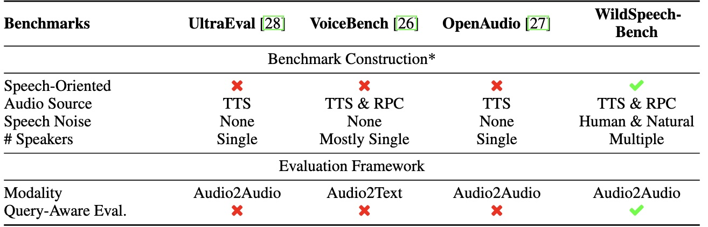

<h2 align="center" style="font-size: 2.5em; font-weight: bold; color: #2c3e50;">
  WildSpeech-Bench: Benchmarking Audio LLMs in
Natural Speech Conversation
</h2>

<p align="center">
  <a href="https://arxiv.org/abs/2506.21875" style="margin: 0 10px;">📑 Paper</a>
  <a href="https://huggingface.co/datasets/tencent/WildSpeech-Bench" style="margin: 0 10px;">🤗 Dataset</a> |
  <a href="https://github.com/Tencent/WildSpeech-Bench" style="margin: 0 10px;">🐙 GitHub</a>
</p>

This repository contains the evaluation code for the paper "[WildSpeech-Bench: Benchmarking Audio LLMs in Natural Speech Conversation]()".

---

## 🔔 Introduction

<p align="center">
   
</p>

**WildSpeech-Bench** is the first end-to-end, systematic benchmark for evaluating the capabilities of audio-to-audio speech dialogue models. The dataset is designed with three key features:

- Realistic and Diverse Data Curation: We collect real-world chat queries relevant to speech scenarios and synthesize speech data with controlled variations in age, gender, timbre, and speaker distance, ensuring diversity, complexity, and broad coverage.

- Audio-Specific Challenge Simulation: The dataset introduces speech-specific challenges, including queries with semantic ambiguity caused by pauses or emotions, sentences containing near-homophones, and utterances with stuttering. We also incorporate different types of background noise to better assess model robustness in realistic conditions.

- Fine-Grained Performance Evaluation: We design tailored checklists and evaluation prompts for suitable queries, providing fine-grained and scenario-specific assessment criteria that better reflect human requirements and preferences in speech conversations.

## 🏆 Main Result
Main evaluation results. TC, II, SR, OE, PF each stand for Text Creation, Information Inquiry, Solution Request, Opinion Exchange and Paralinguistic-Featured query.

| Model                | TC   | II   | SR   | OE   | PF  | Avg. |
|----------------------|------|------|------|------|------------------------|------|
| Naive Pipeline       | 5.55 | 4.98 | 5.51 | 5.18 | 4.84                   | 5.24 |
| GLM-4-Voice       | 5.16 | 4.77 | 5.41 | 5.04 | 4.51                   | 5.03 |
| MiniCPM          | 5.17 | 4.89 | 5.28 | 5.31 | 4.78                   | 5.08 |
| Qwen-2.5-omni     | 5.98 | 5.84 | 6.66 | 6.16 | 4.46                   | 6.01 |
| GPT-4o-Audio      | 6.74 | 6.06 | 6.39 | 6.32 | 6.01                   | 6.29 |


## ⚙️ Installation 
1. Clone the repository
2. Set up
```bash
conda create -n wildspeech python=3.10
conda activate wildspeech
pip install -r requirements.txt
```


## 📝 Usage

### Basic Command

```bash
bash scripts/evaluate.sh <model> <step> 
```

### Parameters

- `model`: Name of the model to evaluate
  - Supported models: qwen2p5-omni, naive-qwen, minicpm, baichuan-audio, baichuan-omni, kimi-audio, etc.
- `step`: Evaluation step to execute (1-3)
  - 1: Generate audio and transcriptions
  - 2: Evaluate transcription quality using GPT
  - 3: Analyze and summarize results

### Examples

Evaluate all steps for qwen2p5-omni model:
```bash
bash scripts/evaluate.sh qwen2p5-omni 1
```

Run only gpt-4o-mini judge step:
```bash
bash scripts/evaluate.sh qwen2p5-omni 2
```
Run only results analysis step:
```bash
bash scripts/evaluate.sh qwen2p5-omni 3
```


## 📜 License
See the [License.txt](./License.txt) file for details.

## 💐 Thanks
- We borrow a lot of code from VoiceBench: https://github.com/MatthewCYM/VoiceBench
