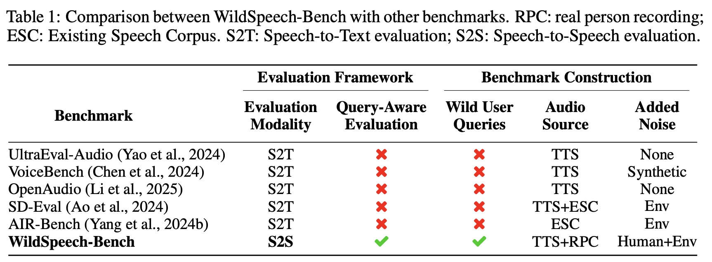
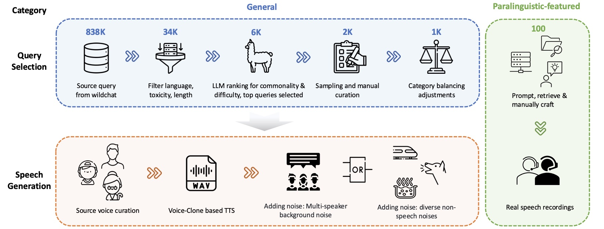

<h2 align="center" style="font-size: 2.5em; font-weight: bold; color: #2c3e50;">
WildSpeech-Bench: Benchmarking End-to-End SpeechLLMs in the Wild
</h2>

<p align="center">
  <a href="https://arxiv.org/abs/2506.21875" style="margin: 0 10px;">📑 Paper</a> |
  <a href="https://huggingface.co/datasets/tencent/WildSpeech-Bench" style="margin: 0 10px;">🤗 Dataset</a> |
  <a href="https://github.com/Tencent/WildSpeech-Bench" style="margin: 0 10px;">🐙 GitHub</a>
</p>

This repository contains the evaluation code for the paper "<a href="https://arxiv.org/abs/2506.21875" style="margin: 0 10px;">[WildSpeech-Bench: Benchmarking End-to-End SpeechLLMs in the Wild]</a>".

---

## 🔔 Introduction

<p align="center">
   
</p>

WildSpeech-Bench is the first benchmark for evaluating the **speech-to-speech** capabilities of speechLLMs, characterized by both its evaluation framework and its construction process.


## 🪝 Construction 

<p align="center">
   
</p>

Our benchmark construction process directly counters the limitations of current datasets, resulting
in a curated collection of 1,100 queries organized into five major categories. Each category reflects a
common user intent, facilitating granular analysis and ensuring comprehensive coverage of real-world
demands on SpeechLLMs. This involves not only meticulously filtering for queries characteristic of spoken interaction but also a crucial subsequent phase of manual auditing, where **every selected query
was validated by human experts** to ensure its quality and relevance.

Our evaluation framework significantly improves the precision of LLM-based judging for S2S
interactions. Moving beyond generic rubrics that often overlook critical nuances, we strategically
employ unique evaluation prompts for challenging queries. Crucially, these are not generic templates
but **meticulously hand-crafted checklists**, each manually authored and fine-tuned by our team to
highlight a specific query’s characteristics and potential pitfalls. 


## 🏆 Main Result
Main evaluation results. TC, II, SR, OE, PF each stand for Text Creation, Information Inquiry, Solution Request, Opinion Exchange and Paralinguistic-Featured query.

| Model                | TC   | II   | SR   | OE   | PF  | Avg. |
|----------------------|------|------|------|------|------------------------|------|
| Naive Pipeline       | 5.55 | 4.98 | 5.51 | 5.18 | 4.84                   | 5.24 |
| Kimi-Audio       | 4.45 | 4.33 | 4.79 | 4.70 | 4.92                   | 4.54 |
| GLM-4-Voice       | 5.16 | 4.77 | 5.41 | 5.04 | 4.51                   | 5.03 |
| MiniCPM          | 5.17 | 4.89 | 5.28 | 5.31 | 4.78                   | 5.08 |
| Qwen-2.5-omni     | 5.98 | 5.84 | 6.66 | 6.16 | 4.46                   | 6.01 |
| GPT-4o-Audio      | 6.74 | 6.06 | 6.39 | 6.32 | 6.01                   | 6.29 |


## ⚙️ Installation 
1. Clone the repository
2. Set up
```bash
conda create -n wildspeech python=3.10
conda activate wildspeech
pip install -r requirements.txt
```


## 📝 Usage

### Basic Command

```bash
bash scripts/evaluate.sh <model> <step> 
```

### Parameters

- `model`: Name of the model to evaluate
  - Supported models: qwen2p5-omni, naive-qwen, minicpm, baichuan-audio, baichuan-omni, kimi-audio, etc.
- `step`: Evaluation step to execute (1-3)
  - 1: Generate audio and transcriptions
  - 2: Evaluate transcription quality using GPT
  - 3: Analyze and summarize results

### Examples

Evaluate all steps for qwen2p5-omni model:
```bash
bash scripts/evaluate.sh qwen2p5-omni 1
```

Run only gpt-4o-mini judge step:
```bash
bash scripts/evaluate.sh qwen2p5-omni 2
```
Run only results analysis step:
```bash
bash scripts/evaluate.sh qwen2p5-omni 3
```

## 🔦 Citation
 ```bibtex
@misc{zhang2025wildspeechbenchbenchmarkingendtoendspeechllms,
      title={WildSpeech-Bench: Benchmarking End-to-End SpeechLLMs in the Wild}, 
      author={Linhao Zhang and Jian Zhang and Bokai Lei and Chuhan Wu and Aiwei Liu and Wei Jia and Xiao Zhou},
      year={2025},
      eprint={2506.21875},
      archivePrefix={arXiv},
      primaryClass={cs.CL},
}
```


## 📜 License
See the [License.txt](./License.txt) file for details.

## 💐 Thanks
- We borrow a lot of code from VoiceBench: https://github.com/MatthewCYM/VoiceBench
